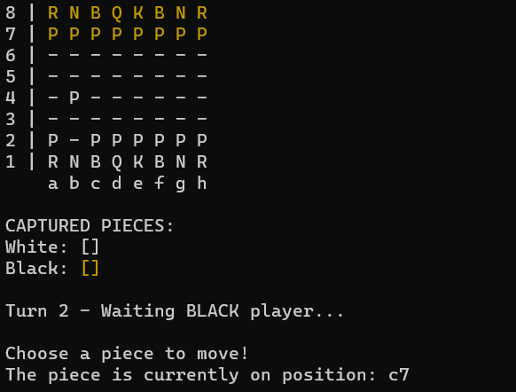

# Jogo de Xadrez

<!---Esses são exemplos. Veja https://shields.io para outras pessoas ou para personalizar este conjunto de escudos. Você pode querer incluir dependências, status do projeto e informações de licença aqui--->




> Jogo de Xadrez construído em Java; possui todas as funcionalidades e regras do jogo - inclusive as jogadas de Roque, 'En Passant' e promoção do peão. 

<br>

## 💻 Pré-requisitos

Antes de começar, verifique se você atendeu aos seguintes requisitos:
* Você possui a versão do `Java 11`
* Você possui `conhecimentos básicos de Xadrez`

<br>

## ☕ Jogando o Jogo de Xadrez

Para jogar o Jogo de Xadrez, abra a pasta do projeto no seu terminal e insira esses comandos:

```
cd out\production\Chess-System
```

```
java application/Main
```
